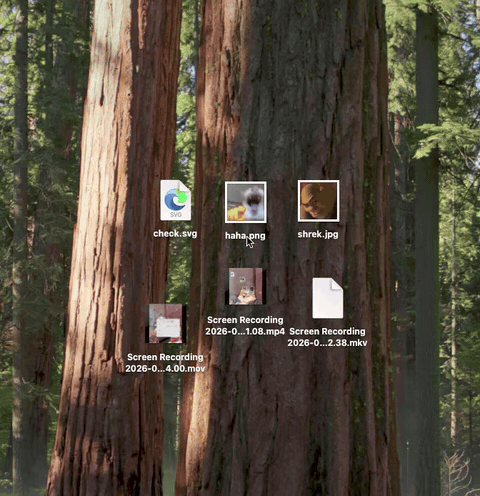
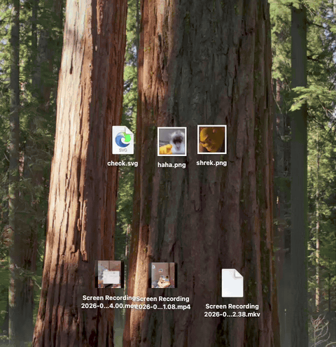

# Hehe Converter

Native macOS menu-bar app for converting dragged images, videos, and audio files without opening a full editor. Drag files from Finder, hold a shortcut, then drop onto a conversion preset or built-in image action.

[Read in Vietnamese](README.md)

Idea inspired by [th2049 on X](https://x.com/th2049/status/2097015553508725184).

## Features

- Convert images, videos, and audio from a radial drag-and-drop menu.
- Resize, crop, or compress images with interactive previews.
- Process multiple files sequentially or in parallel.
- Add and edit image, video, and audio presets.
- Add custom FFmpeg command presets for video conversion.
- Install and verify an app-managed FFmpeg build from settings.
- Run entirely from the macOS menu bar.

## Preview

### Convert with presets

Drag supported files from Finder, hold the conversion shortcut, then drop onto an output preset.



### Image actions

Drag images from Finder, hold `Shift` + `Option`, then drop onto Resize, Crop, or Compress.



## Requirements

- macOS 13.0 or later
- FFmpeg and FFprobe for media processing

Hehe Converter can download a compatible FFmpeg build during first launch. Existing Homebrew, MacPorts, and supported `$PATH` installations can also be detected.

## Usage

### Convert files

1. Launch Hehe Converter. Its icon appears in the menu bar; no Dock window opens.
2. Drag one or more files from Finder.
3. While dragging, hold `Shift` by default. Change this shortcut in **Settings > Shortcuts**.
4. Move pointer over a preset in the radial menu.
5. Drop files to start conversion.
6. Use progress panel to monitor or cancel work. Completed outputs appear beside source files with a non-conflicting filename.

Preset menu matches dragged media type. Mixed image, video, and audio selections do not produce a conversion menu.

### Edit images

1. Drag one or more images from Finder.
2. Hold `Shift` + `Option` while dragging.
3. Drop onto **Resize**, **Crop**, or **Compress**.
4. Adjust preview controls, then choose **Apply**.

For multiple images, Resize and Compress support:

- **All**: apply shared settings to every image.
- **Each**: configure each image independently.

Enable actions and choose default multi-image modes in **Settings > Actions**.

### Manage presets

Open menu-bar icon, choose **Open Settings...**, then open **Media**:

- **Image**: add or edit format, resize, quality, and format-specific options.
- **Video**: add object presets or custom FFmpeg command presets.
- **Audio**: add or edit audio output presets.
- Folder button opens JSON preset storage for manual inspection.
- Refresh button reloads preset files from disk.

Built-in presets include common image outputs such as WebP, PNG, JPG, AVIF, and TIFF; common video outputs such as MP4, MKV, MOV, WebM, GIF, and animated WebP; and common audio outputs such as MP3, M4A, WAV, FLAC, OGG, and Opus.

### Configure app

Settings sections:

| Section | Options |
|---|---|
| General | Enable app, launch at login, conversion concurrency, multi-file mode, config import/export |
| Media | FFmpeg setup and conversion presets |
| Actions | Enabled image actions and default All/Each modes |
| Shortcuts | Drag shortcut for conversion preset menu |

## Overview

Hehe Converter uses SwiftUI for settings and action editors, AppKit for menu-bar lifecycle and overlay windows, and FFmpeg for conversion. Finder drag monitoring opens a radial overlay near pointer. Dropping onto a choice dispatches either preset conversion or built-in image action.

```text
Finder drag
    |
    +-- conversion shortcut --> preset overlay --> image/video/audio runner
    |
    +-- Shift + Option -------> action overlay --> resize/crop/compress editor
                                                    |
                                                    +--> validated output beside source
```

Safety behavior:

- Source media is never overwritten directly.
- Output uses first available filename when target already exists.
- FFmpeg runs through `Process` arguments, not a shell.
- App-managed FFmpeg downloads require published SHA-256 verification.
- Temporary output is validated before final move.

Managed data lives under `~/.local/com.hoanggbao.HeheConverter/`:

```text
bin/                     Managed ffmpeg, ffprobe, and install metadata
presets/image/           Image preset JSON files
presets/video/           Video preset JSON files
presets/audio/           Audio preset JSON files
user_config.json         Portable app settings
```

## Development

### Prerequisites

- macOS 13.0 or later
- Xcode 26.3 with Swift 6.2
- [XcodeGen](https://github.com/yonaskolb/XcodeGen)

Install XcodeGen with Homebrew:

```sh
brew install xcodegen
```

### Commands

| Command | Purpose |
|---|---|
| `make generate` | Generate `HeheConverter.xcodeproj` from `project.yml` |
| `make open` | Generate and open project in Xcode |
| `make build` | Build debug app into `build/Debug/HeheConverter.app` |
| `make test` | Generate project and run XCTest suite |
| `make run` | Build and open debug app |
| `make release` | Build universal release app for Apple Silicon and Intel |
| `make dmg` | Build release app and package `build/Release/HeheConverter.dmg` |
| `make dmg-ci` | Package a release DMG without Finder UI for CI |
| `make bump 1.0.1` | Update project version, commit it, and create local tag `v1.0.1` |
| `make reset-onboarding` | Reset first-run FFmpeg onboarding flag |
| `make clean` | Remove local build output and clean Xcode project |

Generated `HeheConverter.xcodeproj` is derived from `project.yml`. Change project configuration in `project.yml`, then run `make generate`.

Hehe Converter has no hot reload. Quit running app from menu-bar menu before another `make run` when testing lifecycle or startup changes.

### Project structure

```text
Sources/
├── App/                    App lifecycle
├── DropOverlay/            Drag detection, radial menu, action editors, progress UI
├── MenuBar/                Menu-bar item and settings/onboarding windows
├── Models/                 Settings and preset models
├── Services/               FFmpeg, conversion, presets, login item, SVG rasterization
├── Settings/               SwiftUI settings sections
└── Stores/                 Shared observable state
Tests/                      XCTest coverage by feature
docs/                       Detailed implementation documentation
preview/                    README demo videos
project.yml                 XcodeGen project source
Makefile                    Development command surface
```

## Documentation

- [FFmpeg integration](docs/ffmpeg.md): discovery, download, checksum verification, installation, and media support.
- [Onboarding](docs/onboarding.md): first-run FFmpeg setup states and development reset.
- [Releases](docs/releasing.md): CI checks, version tags, and GitHub Release artifacts.

README covers product use and contributor entry points. Detailed integration behavior and implementation decisions live under [`docs/`](docs/).
