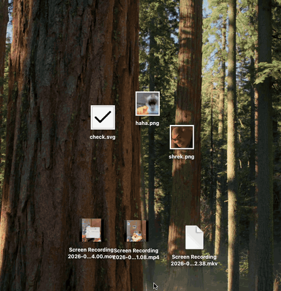

# Hehe Converter

MacOS menu-bar app for converting and lightly editing images, video, and audio via drag-and-drop — no full editor required.

## Preview

**Convert** — drag files, hold the conversion shortcut (default `Shift`), drop onto a preset.


**Image actions** — drag images, hold `Shift` + `Option`, drop onto Resize / Crop / Compress.


**Video actions** — drag videos, hold `Shift` + `Option`, drop onto Crop / Trim / Speed / Snapshot / Compress / Mute / Transform…



## Motivation

Make everyday media conversion and light edits on macOS feel as fast as dragging files in Finder, without opening a heavyweight editor.

## Tech

- **Swift 6.2** · **SwiftUI** (Settings / editors) · **AppKit** (menu bar, overlay, drag)
- **macOS 13.0+**
- **FFmpeg** app-managed (or detected Homebrew / MacPorts / `$PATH`)

Platform code lives under [`macos/`](macos/). [`windows/`](windows/) is reserved for the future
Windows implementation. Root `make` commands currently delegate to the macOS project.

## Installation

Download the DMG from [Releases](https://github.com/hoanggbao00/hehe-converter/releases), or build from source:

```sh
make generate
make run
```

## Development

```sh
brew install xcodegen
make open    # generate + open Xcode
make test
make build
```

More detail: [`docs/`](docs/) — [FFmpeg](docs/ffmpeg.md), [Onboarding](docs/onboarding.md), [Releases](docs/releasing.md).

## License

[GPL-3.0](LICENSE). You may use, modify, fork, and redistribute it (including commercially). Distributed copies must remain under GPL-3.0 and include the corresponding source.
